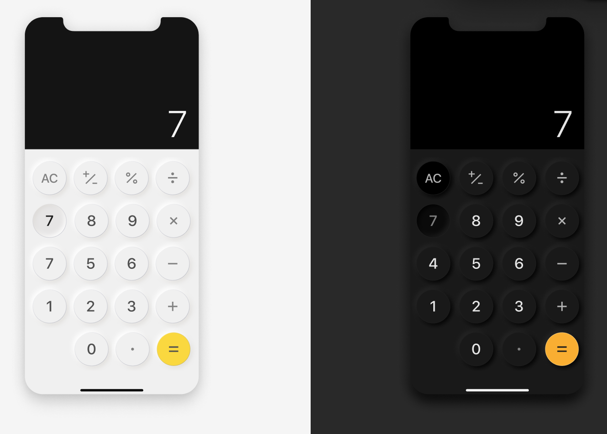

# CalculatorSwiftUI - Your Smart and Intuitive Calculator App 🧮✨

CalculatorSwiftUI is an advanced iOS calculator app designed to provide a seamless and user-friendly experience. Developed using SwiftUI, it features a clean interface and robust functionality, making it your go-to tool for all your arithmetic needs.

<div style="display: flex; flex-direction: row; gap: 10px;">
     
   </div>

## Key Features

1. **Basic Arithmetic Operations ➕➖✖️➗**
   - Perform addition, subtraction, multiplication, and division with ease.
   - Supports continuous calculations, allowing you to chain multiple operations together.
   
2. **Error Handling 🛡️**
   - Gracefully handle division by zero with an "Error" message.
   - Displays "Out of bounds" when the result exceeds 999,999,999, ensuring clarity for large calculations.

3. **Custom Number Formatting 📏**
   - Format numbers with spaces for better readability.
   - Automatically trim unnecessary trailing zeros in decimal numbers.
   - Display up to 8 decimal places based on the length of the integer part.

4. **Responsive Design 🎨**
   - Adjusts font size dynamically based on the length of the input, ensuring readability on all screen sizes.
   - Clear and intuitive button layout designed for ease of use.

5. **Memory and Last Operation Recall 🧠**
   - Keeps track of the last operation and operand, allowing for easy repeated calculations.
   - Clear memory function to reset the calculator state.

6. **Advanced Input Handling ⌨️**
   - Properly manage inputs to avoid errors such as leading zeros.
   - Toggle sign functionality to quickly switch between positive and negative numbers.
   - Percentage calculations made easy with a dedicated button.

## Installation

1. **Clone the repository**:
    ```bash
    git clone https://github.com/your-username/CalculatorSwiftUI.git
    ```

2. **Open the project**:
    ```bash
    cd CalculatorSwiftUI
    open CalculatorSwiftUI.xcodeproj
    ```

3. **Build and run the project** using Xcode.

## Usage

### Basic Operations
1. **Input Numbers**: Tap the number buttons (0-9) to input numbers.
2. **Select Operation**: Tap on an operation button (+, -, ×, ÷) to select the desired arithmetic operation.
3. **Calculate**: Tap the "=" button to compute the result.
4. **Clear**: Tap the "AC" button to reset the calculator.
5. **Toggle Sign**: Tap the "±" button to toggle the sign of the current number.
6. **Percentage**: Tap the "%" button to calculate the percentage of the current number.

### Edge Cases
- **Division by Zero**: The app will display "Error" if there is an attempt to divide by zero.
- **Out of Bounds**: The app will display "Out of bounds" if the result exceeds 999,999,999.

### Formatting
- **Thousand Separator**: Numbers are formatted with spaces as thousand separators for better readability.
- **Decimal Places**: The number of decimal places displayed is based on the length of the integer part of the number.
- **Trim Trailing Zeros**: Trailing zeros in the decimal part are automatically trimmed for a cleaner display.
